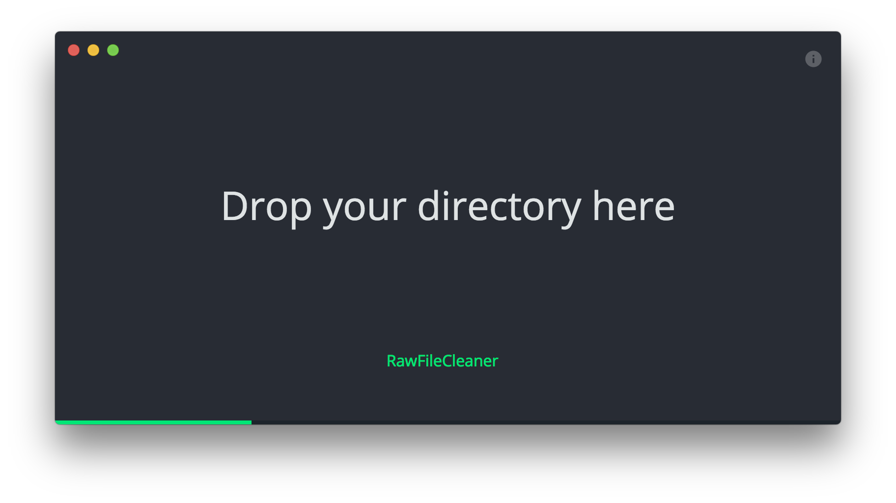

# Pflichtenheft

| Projektbezeichnung | Raw/Jpeg         |
|--------------------|------------------|
| Projektleiter      | Helcig Michael   |
| Verantwortlich     | Thomas Stütz     |
| Erstellt am        | 18.11.2017       |
| Zuletzt geändert   | 01.12.2017       |

## Weitere Produktinformationen
Mitwirkend

* Christian Straßmayr
* Hannes Gerstmayr

## Änderungsverzeichnis
| Änderung (Nr/Datum/Version) | Geänderte Kapitel | Beschreibung der Änderung | Autor |
|-----------------|-----------|-------------------|---------------------------|  
|1 / 18.11.2017 / 0.1 | Alle | Pflichtenheft Erstellung | Christian Straßmayr|
|2 / 24.11.2017 / 0.2 | Alle | Pflichtenheft Verbesserung + Erweiterung | Hannes Gerstmayr|
|3 / 01.12.2017 / 0.3 | Alle | Pflichtenheft Verbesserung + Erweiterung | Helcig Michael |
|4 / 14.01.2018 / 0.4 | 3. (Funktionale Anforderungen) | Update der beiden Diagramme | Hannes Gerstmayr |

## Inhalt

1. Motivation
2. Ausgangssituation und Zielsetzung
  1. Ausgangssituation
    1. Ist-Zustand
    2. Beschreibung des Problembereiches
    3. Glossar
  2. Zielbestimmung
3. Funktionale Anforderungen
  1. Use Case Diagramme
4. Nicht-funktionale Anforderungen
5. Mengengerüst
6. Risikoakzeptanz
7. Lebenszyklusanalyse und Gesamtsystemarchitektur
8. Schnittstellenübersicht
9. Lieferumfang
10. Abnahmekriterien
11. Anforderungsverfolgung zu den Anforderungen (Lastenheft)
12. Abkürzungsverzeichnis
13. Literaturverzeichnis
14. Abbildungsverzeichnis

## 1 Motivation
Es soll im Rahmen des Gegenstandes "Systemplanung und Projektentwicklung" ein Programm implementiert werden, welches die RAW – Dateien in einem Verzeichnis löscht, zu welchen es keine passende JPEG – Datei mehr gibt.

## 2 Ausgangssituation und Zielsetzung
Es stellt ohne professionelle Software einen großen Aufwand dar, die Raw – Dateien von bereits gelöschten JPEG – Dateien zu entfernen. Das zu entwickelnde Programm soll diesen langwierigen Arbeitsschritt erleichtern.

### 2.1 Ausgangssituation
Bei (fast) allen Kameras kann jedes Foto als RAW und JPEG Datei gespeichert.

###### Was ist RAW?
Beim Fotografieren im RAW-Format werden die Fotos unbearbeitet und unkomprimiert komplett „roh“ auf der Speicherkarte abgelegt. Dabei werden die Bilder nicht im JPG-Format gespeichert, sondern in einem spezifischen Rohdatenformat, welches je nach Hersteller ein anderes ist (Canon verwendet z.B. die Dateiendung .CR2). Das RAW-Format beinhaltet sämtliche Bildinformationen in unbearbeiteter Form, so wie sie vom Sensor der Kamera aufgezeichnet worden. Die Dateien lassen sich mithilfe gängiger Programme wie z.B. *Photoshop Elements* oder *Lightroom* bearbeiten.

#### 2.1.1 Ist-Zustand

Viele Fotografen die im se­mi­pro­fes­si­o­nellen Bereich arbeiten, können oder wollen sich keine Software wie *Adobe Photoshop* leisten. Es gibt durchaus Software, welche kostenlos zugänglich ist und die geforderte Aufgabe erfüllt, jedoch lässt sich diese meist nur durch Terminal Kommandos bedienen, dies ist für ungeübte Anwender ein KO - Kriterium.

#### 2.1.2 Beschreibung des Problembereiches:
Beim Löschen der JPEG Dateien werden die zugehörigen RAW Dateien nicht automatisch mitgelöscht und ohne professionelle Software stellt es einen großen Aufwand dar sie zu löschen.

#### 2.1.3 Glossar
| Fachbegriff | Erläuterung |
|-------------|-------------|
|RAW          | Format für unbearbeitete und unkomprimierte Fotos |   

## 2.2 Zielbestimmung
Ziel ist es ein Programm zu verwirklichen das Hobby und semiprofessionelle Fotografen ohne besonderen Vorkenntnissen eine Möglichkeit bietet, ihre Bilddateien schnell und benutzerfreundlich auszusortieren.

## 3 Funktionale Anforderungen
Der Nutzer gibt den Ordner an in dem sich die RAW und die JPEG Dateien befinden und das Programm löscht automatisch alle RAW Dateien zu denen es keine passende JPEG Datei mehr gibt. Es gibt also nur einen Use Case.

### GUI für den Aufruf des Use Cases

|Eingabefeld| Erlaubte Eingabewerte|
|-----------|----------------------|
| Select Source   | Verzeichnis  |
| Include Subfolders   | Ja oder Nein  |
| Clean Files   | Mausklick  |

### Szenario für den Standardablauf

Nachdem der User den Ordner mit den Fotos ausgewählt hat muss er noch auf "Clean Files" klicken und das Programm löscht die RAW-Dateien. Es wird eine Meldung ausgegeben, wenn das Programm fertig ist. (Sowie beim Auftreten eines Fehlers)

| Schritt | Nutzer | Beschreibung der Aktivität |
|---------|--------|----------------------------|
| 1 | User | Select Folder |
| 1 | User | Select whether to include subfolders or not |
| 2  | User | Press "Clean Files" |

### Szenarien für alternative Abläufe
Fehlerfälle treten auf wenn:
* der vom User ausgewählte Ordner nicht existiert
* der User bricht den Löschvorgang ab (zB: schließen des Programmes)

### Beschreibung des allgemeinen Ablaufes

## 4 Nicht-funktionale Anforderungen
| Name |Benutzbarkeitsanforderung  |
|------|---------------------------|
| Typ |  USE |
| Beschreibung  |  Die Software soll sehr unkompliziert bedienbar sein.  |

| Name |Effizienzanforderung  |
|------|----------------------|
| Typ |  EFFIZIENZ |
| Beschreibung  |  Das Löschen darf höchstens eine Sekunde benötigen. (Abhängig von Anzahl, bei >100 Fotos darf es auch mehr Zeit benötigen) |

| Name |Wartbarkeits- und Portierbarkeitsanforderung  |
|------|----------------------------------------------|
| Typ |  PFLEGE |
| Beschreibung  |  Die GUI des Produkts soll so gestaltet werden, dass man sie ohne großen Aufwand erweitern kann. |

| Name |Sicherheitsanforderung  |
|------|------------------------|
| Typ |  SICHER |
| Beschreibung  | Es dürfen unter keinen Umständen Dateien gelöscht werden, zu denen es noch passende JPEG - Dateien gibt.|

| Name |Gesetzliche Anforderung  |
|------|-------------------------|
| Typ |  LEGAL |
| Beschreibung  | Das Programm darf die Dateien nicht insgeheim auf einen Server hochladen, sodass auch keine Dritten Zugriff auf die Bilder haben. Dies ist Pflicht, um die Privatsphäre der Benutzer zu schützen. Selbstverständlich werden auch keine anderen Nutzerdaten gespeichert.|

## 5 Mengengerüst
Wird nicht benötigt?

## 6 Risikoakzeptanz
Bei der Auswahl von Ordner, beziehungsweise Dateien, welche zur Laufzeit nicht mehr existieren, wird eine Fehlermeldung ausgegeben.

## 7 Lebenszyklusanalyse und Gesamtsystemarchitektur

### Entwicklung
Zuerst wird die Funktion zum Auswählen des gewünschten Verzeichnisses, sowie zum Finden und Löschen der RAW Dateien implementiert. Wenn dies funktioniert wird das Programm um eine schlichte, benutzerfreundliche GUI erweitert.

### Wartung
Wenn das Programm voll funktionsfähig ist, ist keine besondere Wartung mehr nötig.

### Stilllegung
Ist nicht geplant, da es ohne zusätzlichen Aufwand für lange Zeit genutzt werden kann.

## 8 Schnittstellenübersicht
Die Benutzerschnittstelle ist bei unserem Projekt die GUI, mit der der Benutzer den gewünschten Ordner auswählen kann und Informationen erhält, was das Programm gerade erledigt.

## 9 Lieferumfang
Zuerst erfolgt eine Lieferung der Programmfunktionalität ohne GUI.
Abschließend folgt die GUI und eventuell Verbesserungen am Code.

## 10 Abnahmekriterien
Das Programm muss ohne Fehler ausführbar sein und die RAW Dateien zu den bereits gelöschten JPEG Dateien löschen.

Sollte das Programm mehrmals ausgeführt werden, dürfen keine weiteren Dateien mehr gelöscht werden.

Wenn der Ordner nicht mehr existiert bzw. nichts zu löschen ist, muss dies dem Benutzer mitgeteilt werden und es darf zu keinem Absturz kommen.

Das Programm darf nicht durch Programmierfehler ressourcenfressend sein.

## 13 Literaturverzeichnis
Diagramme und Bilder sind (mit Hilfe von Drittanbietertools) von uns erstellt worden.

## 14 Abbildungsverzeichnis
* Abb. 1:	UseCase.png
* Abb. 2:	UserInterface.png
* Abb. 3:	Activity.png
