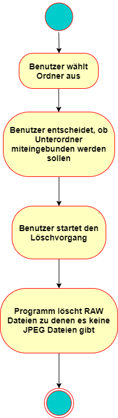

# Pflichtenheft

| Projektbezeichnung | Raw/Jpeg         |
|--------------------|------------------|
| Projektleiter      | Helcig Michael   |
| Verantwortlich     | Thomas Stütz     |
| Erstellt am        | 18.11.2017       |
| Zuletzt geändert   | 05.02.2018       |

## Weitere Produktinformationen
Mitwirkend

* Christian Straßmayr
* Hannes Gerstmayr

## Änderungsverzeichnis
| Änderung (Nr/Datum/Version) | Geänderte Kapitel | Beschreibung der Änderung | Autor |
|-----------------|-----------|-------------------|---------------------------|  
|1 / 18.11.2017 / 0.1 | Alle | Pflichtenheft Erstellung | Christian Straßmayr|
|2 / 24.11.2017 / 0.2 | Alle | Pflichtenheft Verbesserung + Erweiterung | Hannes Gerstmayr|
|3 / 01.12.2017 / 0.3 | Alle | Pflichtenheft Verbesserung + Erweiterung | Helcig Michael |
|4 / 03.12.2017 / 0.4 | Alle | Pflichtenheft Verbesserung | Christian Straßmayr |
|5 / 14.12.2017 / 0.5 | Alle | Pflichtenheft Verbesserung | Christian Straßmayr |
|6 / 14.01.2018 / 0.6 | 3. (Funktionale Anforderungen) | Update der beiden Diagramme | Hannes Gerstmayr |
|7 / 14.01.2018 / 0.6 | 3. (Funktionale Anforderungen) | Update des UserInterface | Helcig Michael |

## Inhalt

* 1 Motivation
* 2 Ausgangssituation und Zielsetzung
  * 1 Ausgangssituation
    * 1 Ist-Zustand
    * 2 Beschreibung des Problembereiches
    * 3 Glossar
  * 2 Zielbestimmung
* 3 Funktionale Anforderungen
  * 1 Use Case Diagramme
* 4 Nicht-funktionale Anforderungen
* 5 Mengengerüst
* 6 Risikoakzeptanz
* 7 Lebenszyklusanalyse und Gesamtsystemarchitektur
* 8 Lieferumfang
* 9 Literaturverzeichnis
* 10 Abbildungsverzeichnis

# 1 Motivation
Es soll im Rahmen des Gegenstandes "Systemplanung und Projektentwicklung" ein Programm implementiert werden, welches die RAW – Dateien in einem Verzeichnis löscht, zu welchen es keine passenden JPEG – Dateien mehr gibt.

# 2 Ausgangssituation und Zielsetzung
Es stellt ohne Software einen großen Aufwand dar, die Raw – Dateien von bereits gelöschten JPEG – Dateien zu entfernen. Das zu entwickelnde Programm soll diesen langwierigen Arbeitsschritt automatisieren.

### 2.1 Ausgangssituation
Bei (fast) allen Kameras kann jedes Foto als RAW und JPEG Datei gespeichert werden.

###### Was ist RAW?
Beim Fotografieren im RAW-Format werden die Fotos unbearbeitet und unkomprimiert „roh“ auf der Speicherkarte abgelegt. Dabei werden die Bilder nicht im JPG-Format gespeichert, sondern in einem spezifischen Rohdatenformat, welches je nach Hersteller ein anderes ist (Canon verwendet z.B. die Dateiendung .CR2). Das RAW-Format beinhaltet sämtliche Bildinformationen in unbearbeiteter Form, so wie sie vom Sensor der Kamera aufgezeichnet worden ist. Die Dateien lassen sich mithilfe gängiger Programme wie z.B. *Photoshop Elements* oder *Lightroom* bearbeiten.

#### 2.1.1 Ist-Zustand

Viele Fotografen die im se­mi­pro­fes­si­o­nellen Bereich arbeiten, können oder wollen sich keine Software wie *Adobe Photoshop* leisten. Es gibt durchaus Software, welche kostenlos zugänglich ist und die geforderte Aufgabe erfüllt, jedoch lässt sich diese meist nur durch Terminal Kommandos bedienen, dies ist für ungeübte Anwender ein KO - Kriterium.

#### 2.1.2 Beschreibung des Problembereiches:
Beim Löschen der JPEG Dateien werden die zugehörigen RAW Dateien nicht automatisch mitgelöscht und ohne professionelle Software stellt es einen großen Aufwand dar sie zu löschen.

#### 2.1.3 Glossar
| Fachbegriff | Erläuterung |
|-------------|-------------|
|RAW          | Format für unbearbeitete und unkomprimierte Fotos |   

## 2.2 Zielbestimmung
Ziel ist es ein Programm zu verwirklichen das Hobby und semiprofessionellen Fotografen ohne besonderen Vorkenntnissen eine Möglichkeit bietet, ihre Bilddateien schnell und benutzerfreundlich auszusortieren.

# 3 Funktionale Anforderungen
Der Nutzer gibt den Ordner an in dem sich die RAW und die JPEG Dateien befinden und das Programm löscht automatisch alle RAW Dateien zu denen es keine passende JPEG Datei mehr gibt. Es gibt also nur einen Use Case.

###### Use Case Diagramm:

### GUI für den Aufruf des Use Cases

|Eingabefeld| Erlaubte Eingabewerte|
|-----------|----------------------|
| Select Source   | Verzeichnis  |
| Include Subfolders   | Ja oder Nein  |
| Clean Files   | Mausklick  |

### Szenario für den Standardablauf
Nachdem der User den Ordner mit den Fotos ausgewählt hat muss er noch auf "Clean Files" klicken und das Programm verschiebt die RAW-Dateien in den Papierkorb. Es wird eine Meldung ausgegeben, wenn das Programm fertig ist. (Sowie beim Auftreten eines Fehlers)

### Szenarien für alternative Abläufe
Fehlerfälle treten auf wenn:
* der vom User ausgewählte Ordner während der Ausführung des RawFileCleaners gelöscht wird
* der User den Löschvorgang abbricht (zB: durch schließen des Programms)

### Beschreibung des allgemeinen Ablaufes

# 4 Nicht-funktionale Anforderungen
| Name |Effizienzanforderung  |
|------|----------------------|
| Typ |  EFFIZIENZ |
| Beschreibung  |  Der Löschvorgang dauert abhängig von der Anzahl der Fotos unterschiedlich lange, es wird aber immer der aktuelle Status und die ungefähre Restdauer des Vorgangs angezeigt damit der User weiß wann der Vorgang in etwa abgeschlossen ist.|

# 5 Mengengerüst
Das Tool wird zu einem Zeitpunkt auch nur von einem Nutzer bedient. Die Menge an Daten ist stark vom Benutzer abhängig, das Tool kann jedoch mit Fotoarchiven aller Größen umgehen.

# 6 Risikoakzeptanz
Wird der ausgewählte Ordner während dem Löschvorgang gelöscht wird eine Fehlermeldung ausgegeben.

# 7 Lebenszyklusanalyse und Gesamtsystemarchitektur

### Entwicklung
Zuerst wird die Funktion zum Auswählen des gewünschten Verzeichnisses, sowie zum Finden und Löschen der RAW Dateien implementiert. Wenn dies funktioniert wird das Programm um eine schlichte, benutzerfreundliche GUI erweitert.

### Wartung
Wenn das Programm voll funktionsfähig ist, ist keine besondere Wartung mehr nötig.

### Stilllegung
Eine Stilllegung ist nicht geplant, da der RawFileCleaner ohne zusätzlichen Aufwand für lange Zeit genutzt werden kann.

# 8 Lieferumfang
Zuerst erfolgt eine Lieferung der Programmfunktionalität ohne GUI.
Abschließend folgt die GUI und eventuell Verbesserungen am Code.

# 9 Literaturverzeichnis
Diagramme und Bilder sind (mit Hilfe von Drittanbietertools) von uns erstellt worden.

# 10 Abbildungsverzeichnis
* Abb. 1:	UseCase.png
* Abb. 2:	UserInterface.png
* Abb. 3:	ActivityDiagram.png
